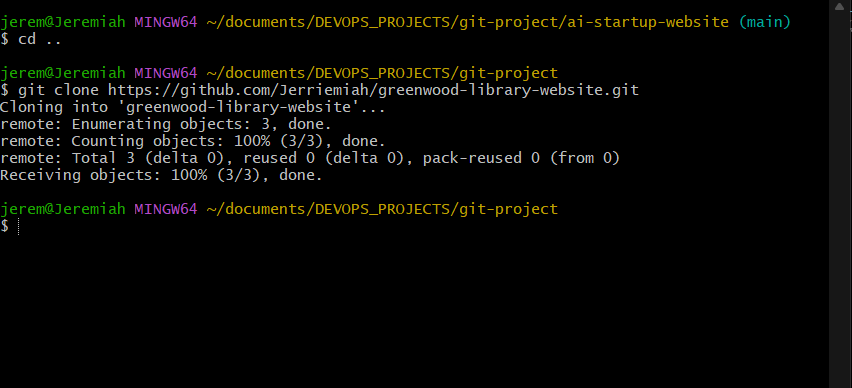
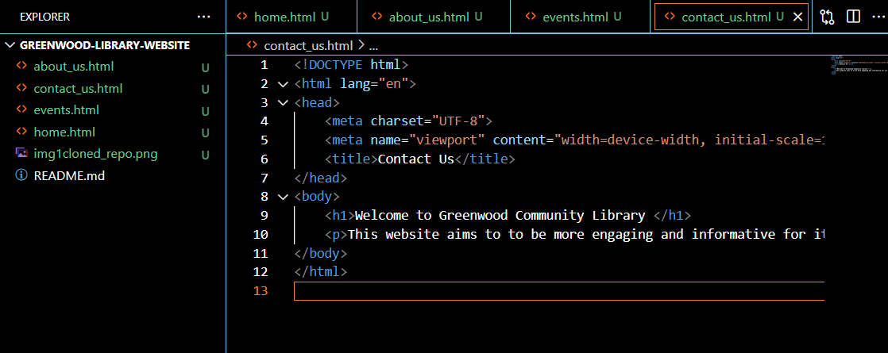
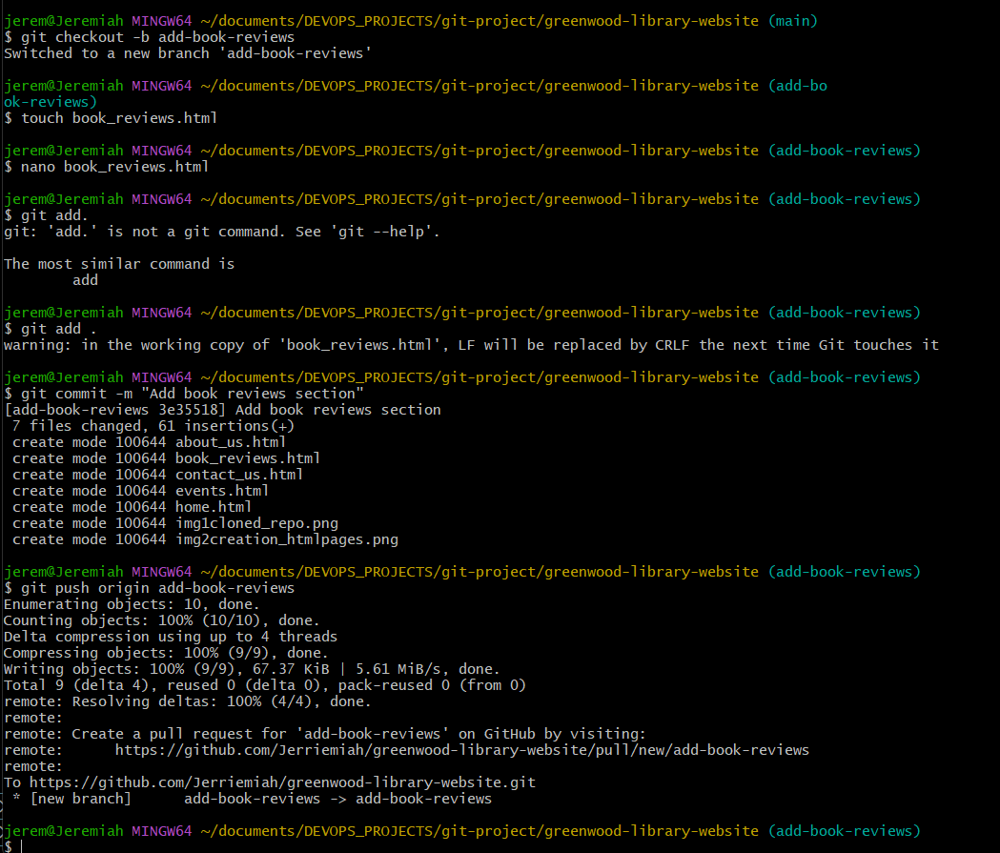
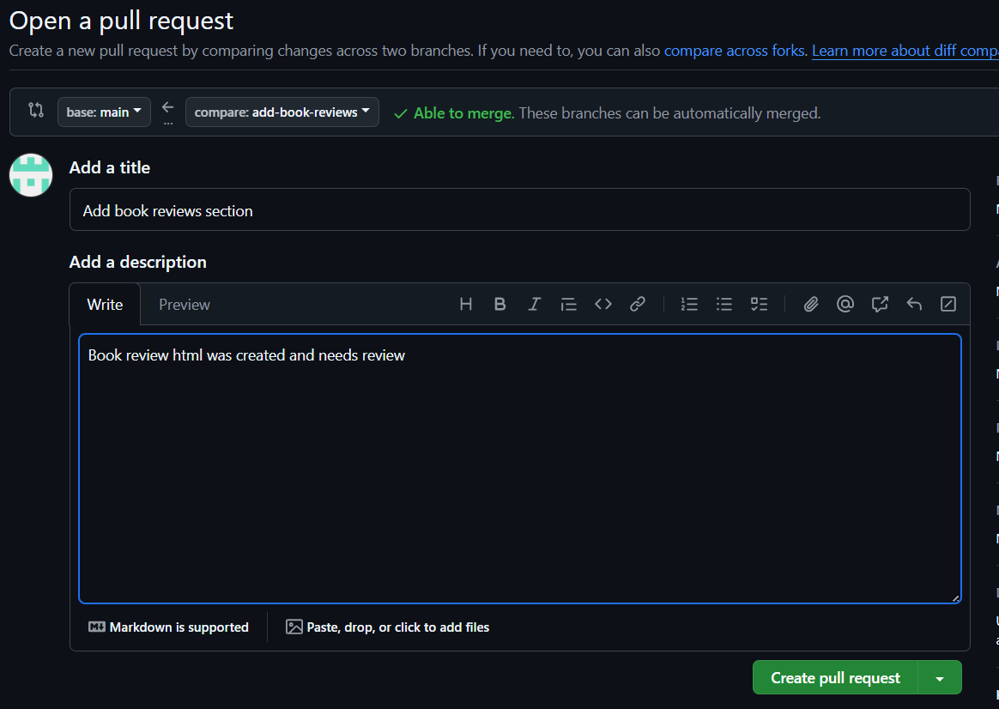
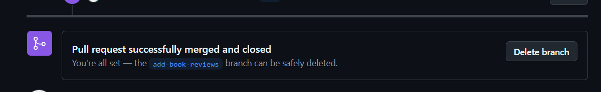
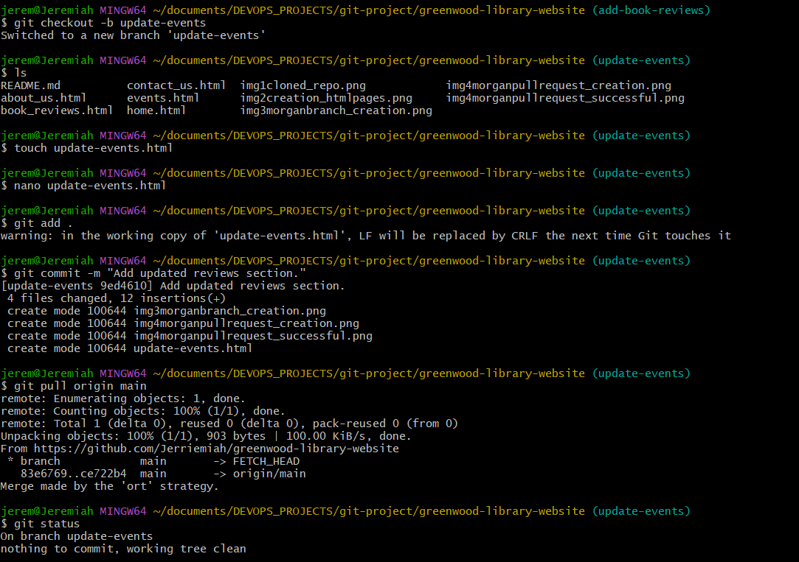
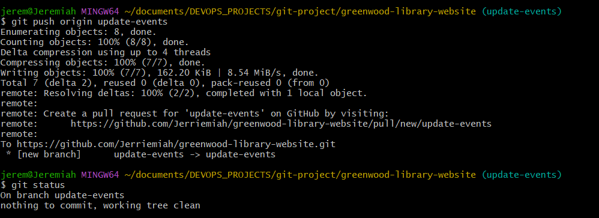

# greenwood-library-website
# Enhancing a Community Library Website

This repository contains a Capstone Project aimed at improving the Community Library website by adding new functionalities and updating existing features.

---

## Project Objectives

- **Add a Book Reviews Section:** Introduce a new section to allow community members to share book reviews.
- **Update the Events Page:** Enhance the Events Page with fresh content and an improved layout.

Link to Repo: [Community Library Website](https://github.com/Jerriemiah/greenwood-library-website/tree/main)

---

## Project Structure

### Repo Cloning and .html for each page created

#

---

### Morgan's Work: Adding Book Reviews
1. **Branch Creation:** A new branch named `add-book-reviews` was created.
2. **Book Reviews Page:** A file `book_reviews.html` was added with random placeholder text.
3. **Version Control:** Changes were staged, committed with a message `"Add book reviews section"`, and pushed to GitHub.
4. **Pull Request:** A PR was raised and merged into the `main` branch.

**Screenshot:**  

#

#

#
---

### Jamie's Work: Updating Events Page
1. **Branch Creation:** A separate branch named `update-events` was created.
2. **Events Page Update:** Enhancements made to `events.html`
3. **Version Control:** Changes were staged, committed with a message `"Update events page"`, and pushed to GitHub.
4. **Pull Request:** A PR was raised and merged into the `main` branch.

**Screenshot:**  

#

#

---
